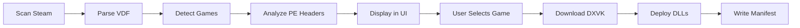

# DXVK Studio: Product Requirements Document

> **Version**: 1.0.0
> **Focus**: Windows Native (Primary), Linux/macOS (Future)
> **Status**: MVP Development

---

## Executive Summary

DXVK Studio is a cross-platform GUI application designed to simplify the installation, management, and configuration of DXVK (DirectX to Vulkan translation layer). The application provides a unified, intuitive interface that automates DLL management, configuration file editing, and environment variable handling.

### Mission Statement
Democratize DXVK usage by transforming it from a command-line-driven utility into an accessible, user-friendly application for all skill levels.

---

## Target Audience

### 1. Windows Users (Primary - MVP Focus)
- Users seeking better performance for legacy DirectX 9/10/11 games
- Gamers with modern GPUs wanting to leverage Vulkan efficiency
- Users avoiding anti-cheat conflicts (single-player focus)

### 2. Linux Gamers (Future)
- Wine/Proton users managing multiple prefixes
- Lutris integration users
- Steam Deck users

### 3. Power Users & Developers
- Multi-version testing requirements
- Performance benchmarking
- Configuration optimization

---

## Core Features

### MVP Features (Windows)

| Feature | Status | Priority |
|---------|--------|----------|
| Steam library scanning | ✅ Complete | P0 |
| Manual game addition | ✅ Complete | P0 |
| PE header analysis (32/64-bit) | ✅ Complete | P0 |
| GitHub release fetching | ✅ Complete | P0 |
| DXVK downloading with progress | ✅ Complete | P0 |
| DLL installation with backup | ✅ Complete | P0 |
| Manifest tracking | ✅ Complete | P0 |
| Uninstallation with restore | ✅ Complete | P0 |
| `dxvk.conf` generation | ✅ Complete | P1 |
| Basic game grid UI | ✅ Complete | P0 |
| Anti-cheat detection | ✅ Complete | P1 |
| Dynamic version dropdown | ✅ Complete | P1 |
| Engine Manager UI | ✅ Complete | P1 |
| Settings/Logs views | ✅ Complete | P2 |

### Post-MVP Features

| Feature | Target Release |
|---------|---------------|
| GOG Galaxy integration | v1.1 |
| Epic Games Store integration | v1.1 |
| Game-specific profiles | v1.2 |
| HUD configuration UI | v1.2 |
| Profile import/export | v1.3 |
| Linux Wine/Proton support | v2.0 |

---

## Technical Architecture

### Technology Stack
- **Framework**: Electron + React + TypeScript
- **Styling**: TailwindCSS
- **Build**: Vite + electron-builder
- **Distribution**: NSIS installer (Windows)

### Core Services

```
electron/services/
├── steam-scanner.ts    # VDF parsing, library detection
├── pe-analyzer.ts      # PE header reading for architecture
├── engine-manager.ts   # GitHub API, downloading, caching
└── deployer.ts         # DLL installation, manifests, config
```

### IPC Architecture

```
Renderer (React) ←→ Preload Bridge ←→ Main Process
     │                                      │
     └──────── electronAPI.* ───────────────┘
```

### Data Flow



---

## DXVK Forks Supported

| Fork | Repository | Use Case |
|------|-----------|----------|
| Official | doitsujin/dxvk | Standard DXVK |
| GPL Async | Ph42oN/dxvk-gplasync | Async shader compilation |
| NVAPI | jp7677/dxvk-nvapi | NVIDIA-specific features |

---

## Anti-Cheat Considerations

> ⚠️ **Important**: DXVK may trigger bans in games with kernel-level anti-cheat.

### Detection Signatures (Implemented)

| Anti-Cheat | Risk Level | Detection Files |
|------------|-----------|-----------------|
| EasyAntiCheat | 🔴 High | `EasyAntiCheat.exe`, `*_x64.dll` |
| BattlEye | 🔴 High | `BEService.exe`, `BEClient*.dll` |
| Vanguard | 🔴 High | `vgc.exe`, `vgk.sys` |
| PunkBuster | 🟡 Medium | `pbsvc.exe`, `PnkBstr*.exe` |

---

## Configuration Options

### dxvk.conf Parameters

```ini
# Performance
dxvk.enableAsync = True
dxvk.numCompilerThreads = 0

# Frame pacing
dxgi.maxFrameLatency = 1
dxgi.syncInterval = -1
dxgi.maxFrameRate = 0

# Memory
dxgi.maxDeviceMemory = 0
dxgi.maxSharedMemory = 0

# HUD
DXVK_HUD = fps,memory,gpuload

# Debug
DXVK_LOG_LEVEL = warn
```

---

## User Flows

### Flow 1: First-Time Setup
1. Launch DXVK Studio
2. Auto-detect Steam installation
3. Scan for installed games
4. Display game library

### Flow 2: Install DXVK
1. Select game from library
2. Choose DXVK fork and version
3. Click "Install DXVK"
4. (Automatic) Download if not cached
5. (Automatic) Backup original DLLs
6. (Automatic) Copy DXVK DLLs
7. (Automatic) Write manifest

### Flow 3: Uninstall DXVK
1. Select game with DXVK installed
2. Click "Uninstall DXVK"
3. (Automatic) Remove DXVK DLLs
4. (Automatic) Restore original DLLs
5. (Automatic) Delete manifest

---

## File Structure

### Deployment Manifest
```json
{
  "gameId": "steam-123456",
  "engineVersion": "2.4",
  "engineFork": "official",
  "architecture": "64",
  "installedAt": "2024-12-21T12:00:00Z",
  "dlls": [
    {
      "name": "d3d11.dll",
      "hash": "sha256...",
      "backupPath": "d3d11.dll.bak_dxvk_studio"
    }
  ],
  "configPath": "C:/Games/Example/dxvk.conf"
}
```

### Engine Storage
```
%APPDATA%/dxvk-studio/engines/
├── official/
│   ├── 2.4/
│   │   ├── x32/
│   │   └── x64/
│   └── 2.3.1/
├── gplasync/
└── nvapi/
```

---

## Success Metrics

| Metric | Target |
|--------|--------|
| Game detection accuracy | >95% |
| Install success rate | >99% |
| Uninstall restore rate | 100% |
| Time to first install | <2 minutes |
| UI render time | <100ms |

---

## References

- [DXVK GitHub](https://github.com/doitsujin/dxvk)
- [DXVK Configuration](https://github.com/doitsujin/dxvk/blob/master/dxvk.conf)
- [Steam VDF Format](https://developer.valvesoftware.com/wiki/KeyValues)
- [PE Format Specification](https://docs.microsoft.com/en-us/windows/win32/debug/pe-format)
